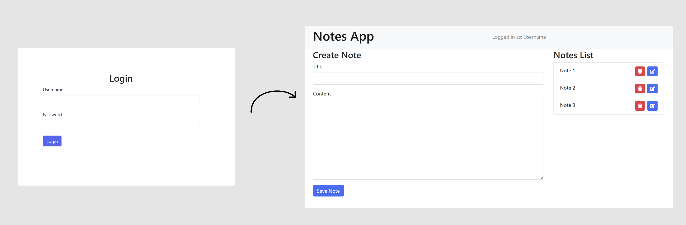

# Feefo
 Feefo Software Engineering Technical Assessment

## Exercise 1

The files and resources for Exercise 1 are located in the folder named `jobTitleMatcher`.

## Exercise 2

The files and resources for Exercise 2 are located in the folder named `ui-assessment-master`.

## Exercise 3

### High-Level Design

The note-taking application, "Notes App", is designed using a microservices architecture. The application is divided into several components, each with a specific role:

- **Frontend**: The user interface of Notes App is built using React. The frontend includes a login screen for user authentication and a separate page that displays a list of notes. Users can also create, edit, and delete notes from this page. The frontend sends HTTP requests to the backend and displays the received responses to the user.

- **Backend**: This is the server-side part of Notes App. It's responsible for processing requests from the frontend and interacting with the database. The backend is built with Spring Boot and exposes a RESTful API with endpoints for user authentication, and CRUD operations on notes.

- **Database**: This is where Notes App's data is stored. Each note is stored as a row in the notes table, with fields for the note's title, content, creation date, and last modification date. The database is built using SQL.

### Web APP UI
In "Notes App", users start at the login page. After entering valid credentials, they receive a JWT token from the backend. This token is stored in the frontend for future authentication.

After login, users are taken to the notes page, where they can see their notes. The notes page interacts with the backend using CRUD operations, with the JWT token included in each request for authentication. 

In this way, the login page directly links to the CRUD notes page, ensuring a seamless and secure user experience.



### Notes Management API

#### 1. User Registration
- Endpoint: `POST /register`
- Parameters: `username`, `password`
- Process:
  - Check if `username` already exists in the database
  - If `username` exists, return an error message
  - If `username` does not exist, hash the `password` and store the `username` and `hashed password` in the database
- Response: Success message

#### 2. User Login
- Endpoint: `POST /login`
- Parameters: `username`, `password`
- Process:
  - Check if `username` exists in the database
  - If `username` does not exist, return an error message
  - If `username` exists, compare the `hashed password` in the database with the `hashed version` of the input `password`
  - If they match, return a success message and a `JWT token` for authentication
  - If they do not match, return an error message
- Response: Success message and JWT token

#### 3. Create Note
- Endpoint: `POST /notes`
- Parameters: `note title`, `note content`, `JWT token`
- Process:
  - Verify the `JWT token` and get the `username`
  - Store the `note title`, `note content` and `username` in the database
- Response: Success message

#### 4. Update Note
- Endpoint: `PUT /notes/{noteId}`
- Parameters: `note title`, `note content`, `JWT token`
- Process:
  - Verify the `JWT token` and get the `username`
  - Check if the `noteId` exists in the database and belongs to the `username`
  - If it does not exist or does not belong to the `username`, return an error message
  - If it exists and belongs to the `username`, update the `note title` and `note content` in the database
- Response: Success message

#### 5. Delete Note
- Endpoint: `DELETE /notes/{noteId}`
- Parameters: `JWT token`
- Process:
  - Verify the `JWT token` and get the `username`
  - Check if the `noteId` exists in the database and belongs to the `username`
  - If it does not exist or does not belong to the `username`, return an error message
  - If it exists and belongs to the `username`, delete the note from the database
- Response: Success message

#### 6. List Notes
- Endpoint: `GET /notes`
- Parameters: `JWT token`
- Process:
  - Verify the `JWT token` and get the `username`
  - Retrieve all notes that belong to the `username` from the database
- Response: List of notes


### Notes Management API JSON Requests and Responses

#### 1. User Registration
- Endpoint: `POST /register`
- JSON Request:
```json
{
  "username": "exampleUser",
  "password": "examplePassword"
}
```

- JSON Response:
```json
{
  "message": "Registration successful",
  "username": "exampleUser"
}
```

#### 2. User Login
- Endpoint: `POST /login`
- JSON Request:
```json
{
  "username": "exampleUser",
  "password": "examplePassword"
}
```

- JSON Response:
```json
{
  "message": "Login successful",
  "username": "exampleUser",
  "token": "exampleJWTtoken"
}
```

#### 3. Create Note
- Endpoint: `POST /notes`
- JSON Request:
```json
{
  "title": "exampleTitle",
  "content": "exampleContent",
  "token": "exampleJWTtoken"
}
```

- JSON Response:
```json
{
  "message": "Note created successfully",
  "note": {
    "id": "noteId",
    "title": "exampleTitle",
    "content": "exampleContent"
  }
}
```

#### 4. Update Note
- Endpoint: `PUT /notes/{noteId}`
- JSON Request:
```json
{
  "title": "updatedTitle",
  "content": "updatedContent",
  "token": "exampleJWTtoken"
}
```

- JSON Response:
```json
{
  "message": "Note updated successfully",
  "note": {
    "id": "noteId",
    "title": "updatedTitle",
    "content": "updatedContent"
  }
}
```

#### 5. Delte Note
- Endpoint: `DELETE /notes/{noteId}`
- JSON Request:
```json
{
  "token": "exampleJWTtoken"
}
```

- JSON Response:
```json
{
  "message": "Note deleted successfully",
  "noteId": "noteId"
}
```

#### 6. List Notes
- Endpoint: `GET /notes`
- JSON Request:
```json
{
  "token": "exampleJWTtoken"
}
```

- JSON Response:
```json
{
  "notes": [
    {
      "id": "noteId1",
      "title": "noteTitle1",
      "content": "noteContent1"
    },
    {
      "id": "noteId2",
      "title": "noteTitle2",
      "content": "noteContent2"
    }
  ]
}
```

### Restful API

Restful API example using Java SpringBoot

```java
@RestController
@RequestMapping("/notes")
public class NoteController {

    @Autowired
    private NoteService noteService;

    @PostMapping
    public ResponseEntity<Note> createNote(@RequestBody Note note) {
        Note createdNote = noteService.createNote(note);
        return new ResponseEntity<>(createdNote, HttpStatus.CREATED);
    }

    @GetMapping("/{noteId}")
    public ResponseEntity<Note> getNote(@PathVariable String noteId) {
        Note note = noteService.getNoteById(noteId);
        return new ResponseEntity<>(note, HttpStatus.OK);
    }

    @PutMapping("/{noteId}")
    public ResponseEntity<Note> updateNote(@PathVariable String noteId, @RequestBody Note note) {
        Note updatedNote = noteService.updateNote(noteId, note);
        return new ResponseEntity<>(updatedNote, HttpStatus.OK);
    }

    @DeleteMapping("/{noteId}")
    public ResponseEntity<String> deleteNote(@PathVariable String noteId) {
        noteService.deleteNote(noteId);
        return new ResponseEntity<>("Note deleted successfully", HttpStatus.OK);
    }

    @GetMapping
    public ResponseEntity<List<Note>> listNotes() {
        List<Note> notes = noteService.getAllNotes();
        return new ResponseEntity<>(notes, HttpStatus.OK);
    }
}
```

```java
@Entity
@Data
@NoArgsConstructor
@AllArgsConstructor
public class Note {

    @Id
    @GeneratedValue(strategy = GenerationType.AUTO)
    private Long id;

    private String title;
    private String content;
}
```


